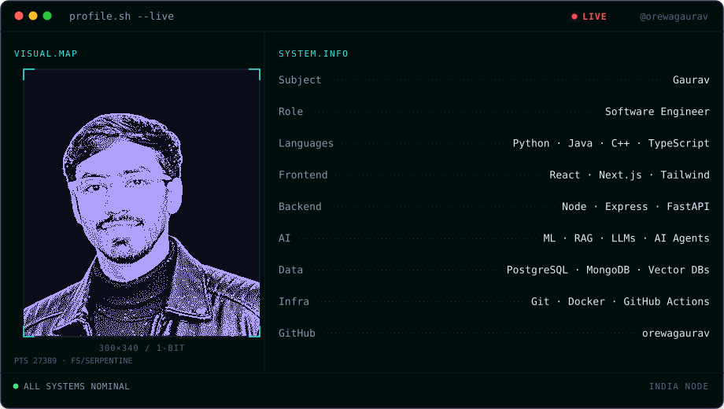
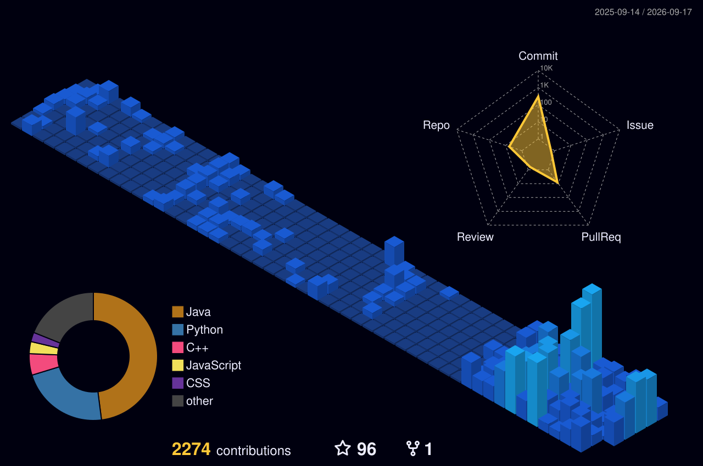

<h1>Hello There </h1>

<div align="center">

<picture>
  <source
    media="(prefers-color-scheme: dark)"
    srcset="assets/profile-banner/banner-dark.svg"
  />
  <source
    media="(prefers-color-scheme: light)"
    srcset="assets/profile-banner/banner-light.svg"
  />
  
</picture>

<!-- NAME / TAGLINE - animated typing -->
<a href="https://github.com/orewaGaurav">
  
</a>

<br>

<!-- SOCIALS -->
<a href="https://orewagaurav.com">
  
</a>&nbsp;&nbsp;

<a href="https://www.linkedin.com/in/orewagaurav/">
  
</a>&nbsp;&nbsp;

<a href="https://instagram.com/orewagaurav_">
  
</a>

<br>
<br>

&nbsp;&nbsp;
</div>

<h2>This is me :)</h2>
<div>
  <ul>
    <li>🎓 <b>B.Tech Computer Science</b> @ <a href="https://www.niet.co.in/">Noida Institute of Engineering and Technology</a> (2023–2027).</li>
    <li>🚀 Building production-ready <b>AI and full-stack applications</b> using Next.js, React, TypeScript, Node.js, FastAPI, MongoDB, and REST APIs.</li>
    <li>🤖 Currently working with <b>LLMs</b>, <b>Retrieval-Augmented Generation (RAG)</b>, <b>Vector Databases</b>, <b>AI Agents</b>, and automation pipelines.</li>
    <li>🧠 Interested in <b>backend engineering</b>, <b>system design</b>, <b>machine learning</b>, and <b>cybersecurity</b>.</li>
    <li>⚡ Always building.</li>
  </ul>
</div>
<hr>

   
   <h2 align="left">🛠️ Languages & Tools</h2>


<hr>
<!--Featured projects-->
<details><summary><h2>🚀 Featured Projects</h2></summary><br>

<table>
<tr>
<td width="50%" valign="top">

### 🛡️ [Deep Packet Inspection](https://github.com/orewaGaurav/deep-packet-inspection)

Multi-threaded **C++** DPI engine doing TLS SNI classification and rule-based blocking, backed by a Node/Express/MongoDB API and a React dashboard.

`C++` · `Node.js` · `Express` · `MongoDB` · `React`

[**Live Demo →**](https://deep-packet-inspection-iota.vercel.app)

</td>
<td width="50%" valign="top">

### 📊 [E-Commerce Customer Analytics](https://github.com/orewaGaurav/ecommerce-customer-analytics-ml)

ML platform that segments customers with **RFM clustering**, predicts lifetime value (CLV), and flags churn risk for data-driven decisions.

`Python` · `Jupyter` · `Docker` · `Streamlit`

[**Live Demo →**](https://orewagaurav.streamlit.app)

</td>
</tr>
<tr>
<td width="50%" valign="top">

### 🧠 [NIET CodeTantra Solutions](https://github.com/orewaGaurav/niet_codetantra) ⭐ 21

My most-starred repo — a complete set of **C** solutions to the CodeTantra DSA problem set, used by my whole batch.

`C` · `Data Structures` · `Algorithms`

[**View Code →**](https://github.com/orewaGaurav/niet_codetantra)

</td>
<td width="50%" valign="top">

### 🌐 [Portfolio](https://orewagaurav.vercel.app)

My personal site, built with **TypeScript** and deployed on Vercel.

`TypeScript` · `React` · `Tailwind` · `Vercel`

[**Live Site →**](https://orewagaurav.vercel.app)

</td>
</tr>
</table>

</details>

<hr>

## 🏙️ My Year in 3D

<p align="center">
  
</p>


<!--Profile views-->
<details><summary><h2>Stalkers and views 🤓</h2></summary><br>


<h3></h3>

<p>
    <a href="https://github.com/orewaGaurav">
</a>
</p>

</details>

<hr>
<!--My stats-->
<details><summary><h2>My Stats 😉</h2></summary><br>


<h3></h3>

<p>
  
[](https://git.io/streak-stats) 
</br></br>

</p>
</details>
<hr>
<details><summary><h2>Type of coder 👨‍💻</h2></summary><br>

<!--START_SECTION:waka-->


**🐱 My GitHub Data** 

> 📦 239.3 kB Used in GitHub's Storage 
 > 
> 🏆 2,188 Contributions in the Year 2026
 > 
> 💼 Opted to Hire
 > 
> 📜 30 Public Repositories 
 > 
> 🔑 3 Private Repositories 
 > 
📊 **This Week I Spent My Time On** 

```text
🕑︎ Time Zone: Asia/Kolkata

🔥 Editors: 
Claude Code              29 hrs 13 mins      ⬛⬛⬛⬛⬛⬛⬛⬛⬛⬛⬛⬛⬛⬛⬛⬛⬛⬛⬛⬛⬛⬛⬛⬜⬜   92.51 % 
VS Code                  2 hrs 21 mins       ⬛⬛⬜⬜⬜⬜⬜⬜⬜⬜⬜⬜⬜⬜⬜⬜⬜⬜⬜⬜⬜⬜⬜⬜⬜   07.49 % 

🐱‍💻 Projects: 
observer-sessions        28 hrs 36 mins      ⬛⬛⬛⬛⬛⬛⬛⬛⬛⬛⬛⬛⬛⬛⬛⬛⬛⬛⬛⬛⬛⬛⬛⬜⬜   90.52 % 
Socratic                 2 hrs 59 mins       ⬛⬛⬜⬜⬜⬜⬜⬜⬜⬜⬜⬜⬜⬜⬜⬜⬜⬜⬜⬜⬜⬜⬜⬜⬜   09.48 % 

💻 Operating System: 
Mac                      31 hrs 35 mins      ⬛⬛⬛⬛⬛⬛⬛⬛⬛⬛⬛⬛⬛⬛⬛⬛⬛⬛⬛⬛⬛⬛⬛⬛⬛   100.00 % 
```

 Last Updated on 21/09/2026 22:15:53 UTC
<!--END_SECTION:waka-->

### **These Readme stats are generated using github action [awesome-readme-stats](https://github.com/anmol098/waka-readme-stats)**

</details>

<hr>
<h2>💡 Coding Thoughts</h2>


## 🐍 Watch My Contributions Get Eaten

<p align="center">
  <picture>
    <source media="(prefers-color-scheme: dark)"
      srcset="https://raw.githubusercontent.com/orewagaurav/orewagaurav/output/github-contribution-grid-snake-dark.svg">
    <source media="(prefers-color-scheme: light)"
      srcset="https://raw.githubusercontent.com/orewagaurav/orewagaurav/output/github-contribution-grid-snake.svg">
    
  </picture>
</p>


<hr>
<!--Syonara-->
<h1 align ="center"></h1>  
